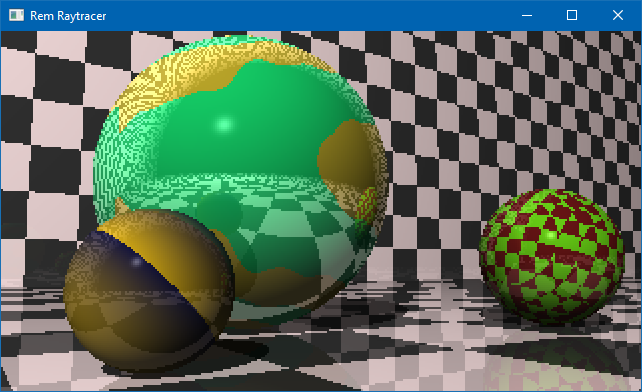

# raytracer
My c++ raytracer project by following the book "The Ray Tracer Challenge: A Test-Driven Guide to Your First 3D Renderer by Jamis Buck"

The project current compiles with
Microsoft Visual Studio Community 2019 - Version 16.5.3
It includes freeglut.

The goal of the project is meant to be built with C++17 and warning level 4.
I tried to have 0 warnings when using Visual Studio static Code Analysis but I haven't got the courage to go over all of them. That and also the 'gsl' doesn't seem to be 100% ready to use.

